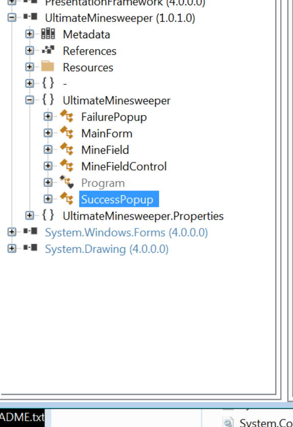

**UltimateMinesweeper.exe**
>.NET is one particular implementation of an ECMA (European Computer Manufacturers Association) standard, which is the standard for the Common Language Infrastructure, or CLI.  
The CLI defines the fact that managed executables use the Portable Executable (PE) File Format, as used by Win32 executables.  
.NET implements CLI and other additional tools and classes.

use PEview shows it's a .NET PE  
  

I first used ILSpy to inspect the content of the executable, hoping to find the flag that way.  
Here it seems the flag we are looking for is proabably defined in the function SuccessPopup.  

However, a close look at it will show us that more work needs to be done. The output of SuccessPopup depends on the cells revealed by the mouse click. Further, the value is then decoded using `GetKey` function before being passed to SuccessPopup.  
  

The mines are burried using the `AllocateMemory` function. The ones with flag set to false are mine-free.  
 

Setting a breakpoint at line 74 revealed that there are three mine-freee cells.

  

To avoid the trouble of figuring out how cells correspond to the numbers, we can simply manipulate the program and trick it into believing that we are clicking the mine-free cells each time we click something.  

This is done through setting a break point at `mouse` function and changing the num and num2 fileds during the runtime.
 

Then after three clicks, we can get the below screen  
 

_Alw4ys_W1n@flare-on.com